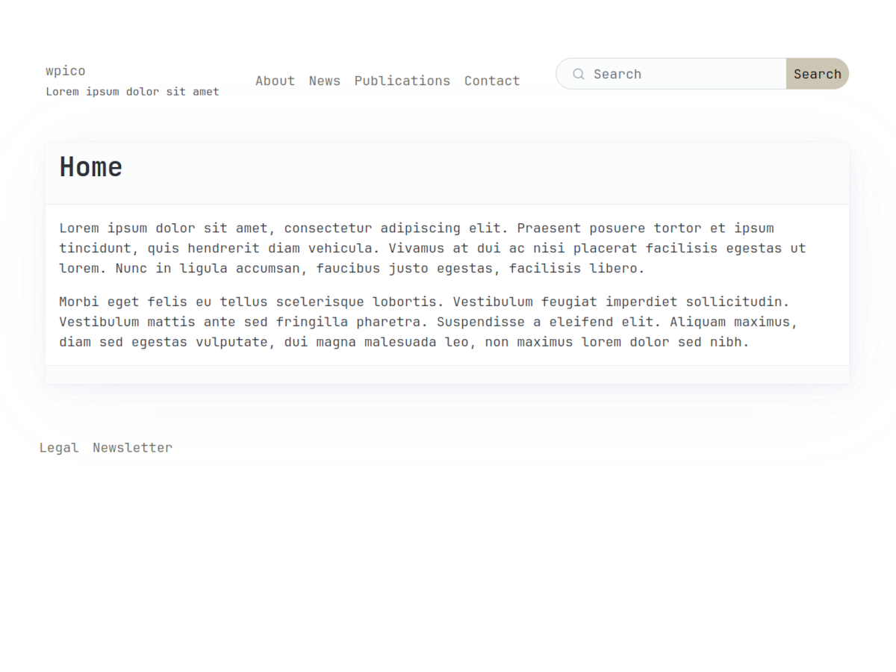
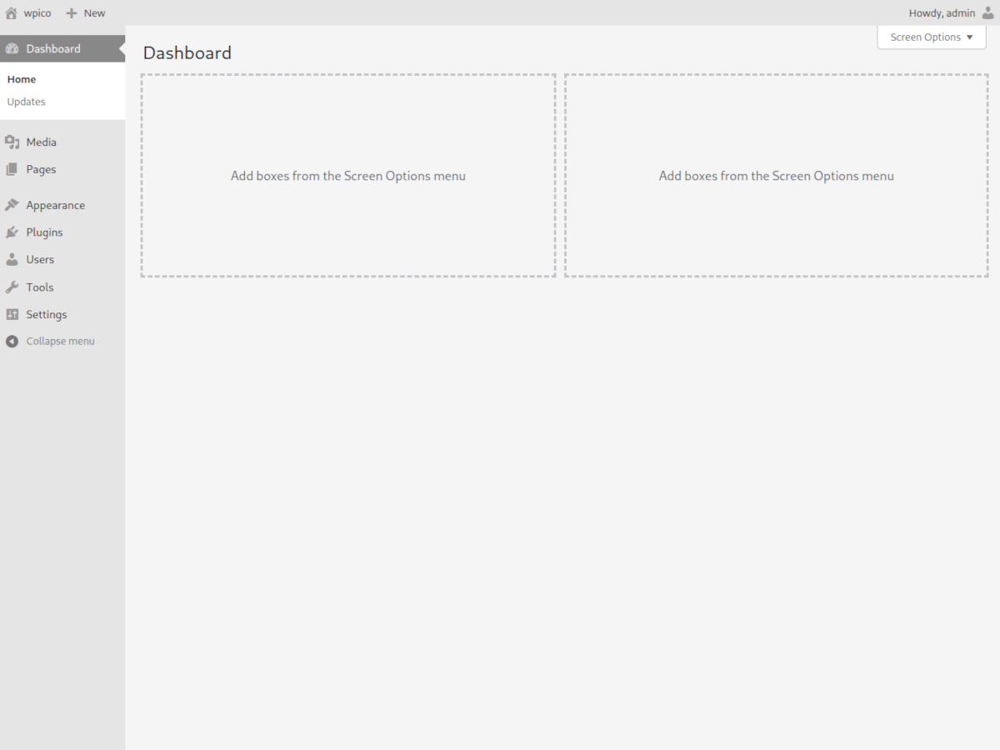

**wpico** is a barebones starter theme for <a href="https://wordpress.org">Wordpress</a> using the <a href="https://picocss.com">Pico CSS</a> framework.

It is designed to be a starting point for developers using Wordpress as a CMS, its goal is to be as lightweight as possible, by removing all the unnecessary bloat that comes with Wordpress and CSS frameworks these days.

## Installation

Clone this repository into your Wordpress themes directory or <a href="https://github.com/mwmdev/wpico/archive/refs/heads/main.zip">download</a> as a zip archive and upload it to your Wordpress admin in « Appearance > Themes > Upload Theme ».

## Features
- Clean head
- Classic editor
- No comments
- No « post » post type
- No « categories » and « tags » taxonomies
- No author archives
- No dates archives
- Lightweight menus
- No dashboard widgets
- No emojis
- No Wordpress branding
- No RSS feeds
- No theme / plugins editor
- Allow webp and svg uploads
- Security headers
- Revisions set to 5 max


## Example

Here's the source code of a default homepage with **wpico** :

```html
<!doctype html>
<html lang="en-US">
  <head>
    <meta charset="UTF-8">
    <meta name="viewport" content="width=device-width, initial-scale=1">
    <link rel="profile" href="https://gmpg.org/xfn/11">
    <link rel='dns-prefetch' href='//cdn.jsdelivr.net' />
    <link rel='stylesheet' id='pico-css' href='https://cdn.jsdelivr.net/npm/@picocss/pico@2/css/pico.sand.min.css?ver=6.5.3' type='text/css' media='all' />
    <link rel="canonical" href="https://wpico.mwm/" />
  </head>
  <body>
    <header class="container">
      <nav>
        <ul>
          <li>
            <a href="https://wpico.mwm/">wpico</a><br/>
            <small>Lorem ipsum dolor sit amet</small>
          </li>
        </ul>
        <ul>
          <li><a href="https://wpico.mwm/about/">About</a></li>
          <li><a href="https://wpico.mwm/news/">News</a></li>
          <li><a href="https://wpico.mwm/publications/">Publications</a></li>
          <li><a href="https://wpico.mwm/contact/">Contact</a></li>
        </ul>
        <ul>
          <li>
            <form role="search" method="get" action="https://wpico.mwm/">
              <input name="s" type="search" placeholder="Search" />
              <input type="submit" value="Search" />
            </form>
          </li>
        </ul>
      </nav>
    </header>
    <main class="container" >
      <article>
        <header>
          <h1>Home</h1>
        </header>
        <p>Lorem ipsum dolor sit amet, consectetur adipiscing elit. Praesent posuere tortor et ipsum tincidunt, quis hendrerit diam vehicula. Vivamus at dui ac nisi placerat facilisis egestas ut lorem. Nunc in ligula accumsan, faucibus justo egestas, facilisis libero.</p>
        <p>Morbi eget felis eu tellus scelerisque lobortis. Vestibulum feugiat imperdiet sollicitudin. Vestibulum mattis ante sed fringilla pharetra. Suspendisse a eleifend elit. Aliquam maximus, diam sed egestas vulputate, dui magna malesuada leo, non maximus lorem dolor sed nibh.</p>
        <footer>
        </footer>
      </article>
    </main>
    <footer class="container">
      <nav>
        <ul>
          <li><a href="https://gfip.mwm/legal/">Legal</a></li>
          <li><a href="https://gfip.mwm/newsletter/">Newsletter</a></li>
        </ul>
      </nav>
    </footer>
  </body>
</html>
```
